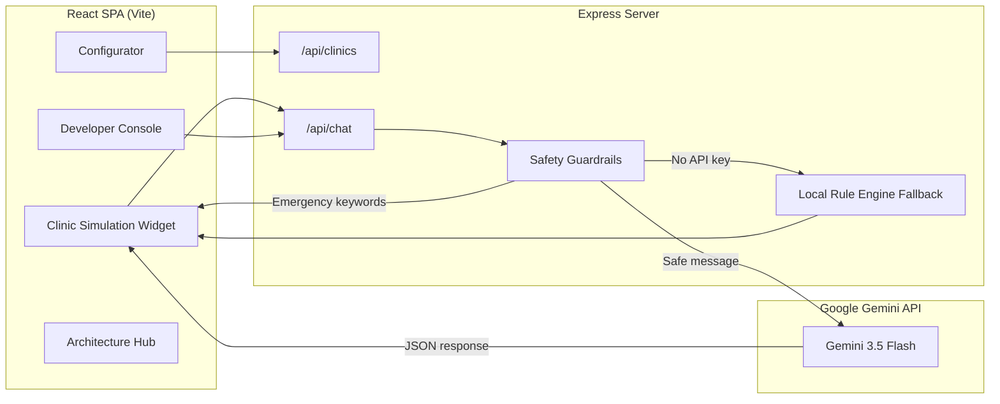

# AI Chatbot Patient Assistant

> **A full-stack UK healthcare AI receptionist platform** — multi-clinic sandbox for dental, GP, and private practices with Gemini-powered chat, safety guardrails, and real-time developer telemetry.

**Repository:** [github.com/mkkbun/AI-Chatbot-Patient-Assistant](https://github.com/mkkbun/AI-Chatbot-Patient-Assistant)

A full-stack **production sandbox and live evaluation system** for multi-clinic AI receptionists, tailored for **dental**, **GP**, and **private clinics** in the UK.

Simulate patient-facing chat widgets, configure clinic profiles in real time, and inspect AI intent classification, contact extraction, and safety guardrails — all from a single developer dashboard.


---

## Table of Contents

- [Overview](#overview)
- [Features](#features)
- [Architecture](#architecture)
- [Tech Stack](#tech-stack)
- [Prerequisites](#prerequisites)
- [Getting Started](#getting-started)
- [Environment Variables](#environment-variables)
- [Usage](#usage)
- [API Reference](#api-reference)
- [Project Structure](#project-structure)
- [Safety & Compliance](#safety--compliance)
- [Production Roadmap](#production-roadmap)
- [Scripts](#scripts)
- [License](#license)

---

## Overview

This platform demonstrates how a digital agency or SaaS provider could deploy **AI-powered virtual receptionists** across multiple UK healthcare tenants. Each clinic has its own profile — services, pricing, tone, opening hours, insurance partners, and safety refusal rules — that dynamically shapes the AI system prompt at runtime.

The app ships with three realistic preset tenants:

| Clinic | Type | Location |
|--------|------|----------|
| **Bright Smile Kensington** | Dental | Kensington High St, London |
| **London Wellness Private GP** | Private GP | Harley Street, London |
| **St. Jude NHS GP Practice** | NHS GP | Cranbourn St, London |

> **Note:** This is a **demonstration and evaluation sandbox**. It uses an in-memory datastore and simulated booking URLs. It is **not** a certified medical device and must not be used for real patient triage without appropriate clinical governance, data protection impact assessments, and regulatory review.

---

## Features

### Patient Web Widget (Simulator)
- Interactive mock clinic website with embedded chat widget
- Real-time conversation powered by **Google Gemini 3.5 Flash** (with intelligent local fallback when no API key is configured)
- **Voice input** (Web Speech API, `en-GB`) and **text-to-speech** responses with British voice preference
- Automatic extraction of patient name, phone, and email across the conversation
- Intent classification: `booking`, `general_qa`, `medical_refusal`, `escalation`
- Human escalation alerts when patients request a receptionist or present complex cases

### SaaS Playground (Configurator)
- Edit clinic profiles: contact details, services, tone, and safety refusal prompts
- Add, remove, and price services dynamically
- Duplicate tenants for multi-clinic demos
- Export clinic configuration as JSON
- Factory reset to restore default presets

### Developer Console
- Live telemetry stream showing API calls, intent detection, and slot extraction
- Compliance status indicators and escalation flags
- Per-clinic prompt context visibility

### Architectural Blueprints
- Production folder structure reference for scaling to a real SaaS
- Documented chat processing workflow (Ingress → Safety → LLM → Extraction → Escalation)
- Copy-ready system prompt template with UK compliance guardrails

---

## Architecture



**Chat processing flow:**

1. **Ingress** — Patient message arrives from the web widget
2. **Safety scan** — Local red-flag detection (chest pain, stroke, suicidal ideation, etc.) triggers instant 999/A&E guidance
3. **LLM inference** — Dynamic system prompt built from the active clinic profile; structured JSON output enforced via schema
4. **Extraction** — Name, phone, and email merged into session state
5. **Escalation** — Human handoff flagged when intent requires offline follow-up

---

## Tech Stack

| Layer | Technology |
|-------|------------|
| Frontend | React 19, TypeScript, Tailwind CSS 4, Motion, Lucide Icons |
| Backend | Node.js, Express, TypeScript |
| AI | Google Gemini API (`@google/genai`) — model: `gemini-3.5-flash` |
| Build | Vite 6, esbuild |
| Dev server | Vite middleware mode integrated into Express |

---

## Prerequisites

- **Node.js** 18 or later
- **npm** (or yarn/pnpm)
- A [Google AI Studio](https://aistudio.google.com/) API key (optional — the app runs with a local rule engine fallback without one)

---

## Getting Started

### 1. Clone the repository

```bash
git clone https://github.com/mkkbun/AI-Chatbot-Patient-Assistant.git
cd AI-Chatbot-Patient-Assistant
```

### 2. Install dependencies

```bash
npm install
```

### 3. Configure environment variables

Copy the example env file and add your Gemini API key:

```bash
cp .env.example .env
```

Edit `.env`:

```env
GEMINI_API_KEY="your-gemini-api-key-here"
```

> Without a valid key, the server logs a warning and uses the built-in local rule engine — useful for UI demos and offline development.

### 4. Start the development server

```bash
npm run dev
```

Open **[http://localhost:3000](http://localhost:3000)** in your browser.

---

## Environment Variables

| Variable | Required | Description |
|----------|----------|-------------|
| `GEMINI_API_KEY` | Recommended | Google Gemini API key from [AI Studio](https://aistudio.google.com/apikey). Enables full AI responses. |
| `APP_URL` | Optional | Public URL when deployed (used for self-referential links and OAuth callbacks in production setups). |
| `NODE_ENV` | Auto | Set to `production` when running the built server. |

---

## Usage

### Simulator tab
1. Select a clinic tenant from the header dropdown
2. Open the chat widget on the mock clinic website
3. Try example prompts:
   - *"What are your opening hours?"*
   - *"How much is a routine check-up?"*
   - *"I'd like to book an appointment — my name is Jane Smith, 07700 900123"*
   - *"Can you diagnose my toothache?"* (triggers medical refusal)
   - *"I'm having chest pain"* (triggers emergency override)
4. Watch the **Developer Console** sidebar for intent and extraction telemetry

### Configurator tab
- Edit any clinic field and click **Save Configuration**
- Use **Duplicate** to create a new tenant from the current profile
- **Download JSON** to export a clinic config for version control or migration
- **Reset All Clinics** restores the three default presets

### Architecture tab
- Review the production engineering blueprint, prompt templates, and scaling guidance

---

## API Reference

### `GET /api/clinics`
Returns all clinic profiles from the in-memory store.

### `POST /api/clinics`
Creates a new clinic. Requires `name` and `type` in the request body.

### `PUT /api/clinics/:id`
Updates an existing clinic by ID.

### `POST /api/clinics/reset`
Resets all clinics to the three default presets.

### `POST /api/chat`
Processes a patient message through the AI receptionist pipeline.

**Request body:**

```json
{
  "clinicId": "bright-smile-dental",
  "messages": [
    { "sender": "user", "content": "Hello, I'd like to book an appointment" }
  ],
  "extractedInfo": {
    "patientName": null,
    "phone": null,
    "email": null
  }
}
```

**Response:**

```json
{
  "reply": "Hello! I'd be delighted to help you book...",
  "extractedInfo": {
    "patientName": "Jane Smith",
    "phone": "07700 900123",
    "email": null
  },
  "intent": "booking",
  "shouldEscalate": false
}
```

**Intent values:** `booking` | `general_qa` | `medical_refusal` | `escalation`

---

## Project Structure

```
uk-ai-patient-assistant-platform/
├── server.ts                    # Express API, Gemini integration, clinic datastore
├── src/
│   ├── App.tsx                  # Main dashboard shell and tab navigation
│   ├── types.ts                 # Shared TypeScript interfaces
│   ├── main.tsx                 # React entry point
│   ├── index.css                # Tailwind global styles
│   └── components/
│       ├── ClinicSimulation.tsx # Patient-facing website + chat widget
│       ├── DeveloperConsole.tsx # Live AI telemetry inspector
│       ├── Configurator.tsx     # Clinic profile editor (SaaS playground)
│       └── ArchitectureHub.tsx  # Production blueprint documentation
├── index.html
├── vite.config.ts
├── tsconfig.json
├── package.json
├── .env.example
└── metadata.json
```

---

## Safety & Compliance

This platform implements **UK healthcare-aware guardrails** designed for demonstration purposes:

- **Emergency keyword detection** — Messages containing terms like *chest pain*, *stroke*, *cannot breathe*, or *suicidal* bypass the LLM and return immediate 999/A&E guidance
- **Medical refusal** — The AI is instructed never to diagnose, prescribe, triage symptoms, or recommend medication
- **Per-clinic safety refusal prompts** — Each tenant defines its own clinical boundary language (NHS 111, emergency dental, A&E, etc.)
- **British spelling enforcement** — System prompts require UK English conventions
- **Structured JSON output** — Responses are schema-validated for predictable downstream processing

These controls are a **starting point**, not a substitute for formal clinical safety review, MHRA/DTAC assessment, or GDPR Article 35 DPIA processes in a live healthcare deployment.

---

## Production Roadmap

The **Architecture Hub** tab documents the recommended path from this sandbox to a production SaaS:

- Persistent multi-tenant database (PostgreSQL / Supabase)
- API gateway with rate limiting and authentication
- Embeddable chat widget distributed via CDN
- Webhook handlers for WhatsApp / SMS (Twilio)
- Separate `ai-engine` package for prompt templates and guardrail middleware
- Docker Compose for local microservice development

---

## Scripts

| Command | Description |
|---------|-------------|
| `npm run dev` | Start development server with hot reload (port 3000) |
| `npm run build` | Build frontend (Vite) and bundle server (esbuild) |
| `npm start` | Run production build (`dist/server.cjs`) |
| `npm run lint` | Type-check with TypeScript (`tsc --noEmit`) |
| `npm run clean` | Remove `dist/` and build artifacts |

### Production deployment

```bash
npm run build
NODE_ENV=production npm start
```

The server serves the Vite-built static assets from `dist/` and handles API routes on the same port.

---

## License

MIT License — see [LICENSE](LICENSE) for details.

---

## Acknowledgements

- Built with [Google Gemini](https://ai.google.dev/) via `@google/genai`
- Originally scaffolded from [Google AI Studio](https://ai.studio/)

---

<p align="center">
  <sub>UK Healthcare AI SaaS Boilerplate — for demonstration and evaluation purposes only.</sub>
</p>
